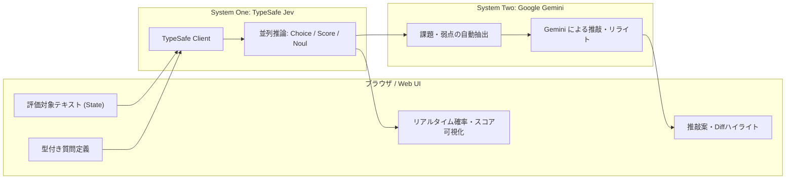

# ⚡ TypeSafe (Jev) Playground & Hybrid AI Pipeline

> **TypeSafe AI の System One モデル（Jev）による高速・型安全な意思決定と、System Two（Google Gemini）による推敲・リライトを融合した Web UI プレイグラウンド**

---

## 🌟 概要

本プロジェクトは、[TypeSafe AI](https://typesafe.ai) の高速推論モデル **Jev (System One)** をブラウザ上で直感的に試せるインタラクティブなプレイグラウンドです。

自然言語テキスト（State）に対して、**Choice（選択）/ Score（スコアリング）/ Noul（Yes/No確率）** の型付き質問を一度のリクエストで並列評価します。  
さらに、Jev が導出した客観的な診断結果（確信度・スコア・課題点）をコンテキストとして **Google Gemini (System Two)** へ引き渡し、文章の弱点をピンポイントで自動修正・リライトする **ハイブリッド AI パイプライン** を備えています。

 <!-- 必要に応じて実際のスクリーンショットに差し替え可能 -->

---

## ✨ 主な機能

### 1. ⚡ System One 高速・型安全評価 (TypeSafe Jev)
- **Choice（単一選択）**: カテゴリ分類や想定読者層など、確率分布と確信度（Confidence）付きで判定。
- **Score（離散・連続スコアリング）**: 怒り度、フックの強さ、難易度などを各レベルの確率加重平均から高精度にスコア化。
- **Noul（Yes/No 確率判定）**:
  - 緊急性や炎上リスクなどを確率で算出。
  - **二者択一判定（50%基準）**: 曖昧な「判断保留」を防ぎ、どちらに優勢かを明確にラベル化（Yes優勢 / No優勢）。
  - **ビジュアルゲージ**: 50%センターライン、確信度バッジ、優勢ハイライトを装備。

### 2. 🧠 System One × System Two 改善パイプライン (Google Gemini)
- Jev による客観診断（弱点・不足要素・炎上リスク）を自動で抽出。
- Gemini が診断内容に基づき、冒頭の引きの強化、具体例の追加、炎上リスクの低減などを考慮したリライト案を生成。
- **📊 リライト前後の Jev 数値比較 (Before vs After)**:
  - リライト後の文章を Jev で即座に自動再推論。
  - 各指標のスコアやYes確率の変化（`+1.23 ↑ 向上`、`-34% ↓ リスク低減` など）をツインバーとデルタバッジで視覚的に比較。
- **ワンクリック反映**: リライト案を入力欄（State）へ即座に反映し、さらなる推敲や再評価が可能。

### 3. 📋 実践的な 6 つのプリセット
| プリセット名 | 評価軸 (Questions) | 主な用途 |
| :--- | :--- | :--- |
| **読者の本音・オピニオン診断**<br>*(『で、あなたの意見は？』チェッカー)* | 筆者のスタンス度 (Score) / 「あなたの意見は？」リスク (Noul) / 一次体験の生々しさ (Score) / AI無味乾燥度 (Noul) / 読者の第一印象 (Choice) | 無難なまとめ記事の脱却・筆者の体温と独自主張の注入 |
| **ブログ記事の品質・推敲チェック** | 文体トーン (Choice) / 導入の引き (Score) / 難易度 (Score) / 具体例 (Noul) / 炎上リスク (Noul) | 記事執筆・コンテンツマーケティングの推敲 |
| **ブログタイトルの魅力度採点** | 刺さる読者層 (Choice) / クリック意欲 (Score) / 煽り度 (Score) / メリット提示 (Noul) | SNS・SEO向けタイトルA/Bテスト検証 |
| **カスタマーサポート分析** | 担当部署 (Choice) / 怒り度 (Score) / 至急対応要否 (Noul) | 問い合わせ自動ルーティング・優先度判定 |
| **投稿モデレーション・安全性** | 種別 (Choice) / 危険度 (Score) / 即時ブロック (Noul) | UGCやプロンプトインジェクションの検知 |
| **プロダクト・レビュー分析** | 感情傾向 (Choice) / 満足度 (Score) / 不具合報告有無 (Noul) | ユーザーフィードバック・VOCの自動集計 |

---

## 🏗️ アーキテクチャ



---

## 📁 ディレクトリ構成

```text
playground-Jev/
├── backend/
│   └── app.py              # FastAPI バックエンド & Gemini 連携 API
├── frontend/
│   ├── index.html          # Web UI レイアウト
│   ├── style.css           # ダークテーマ・アニメーションスタイル
│   └── app.js              # フロントエンド評価ロジック & 可視化
├── docs/                   # プロジェクト技術ドキュメント
├── .env.example            # 環境変数テンプレート
├── .gitignore              # Git 除外設定
├── requirements.txt        # Python 依存関係一覧
├── run_server.py           # 開発用サーバー起動スクリプト
└── sample.py               # TypeSafe SDK 単体実行サンプル
```

---

## 🚀 クイックスタート

### 1. 前提条件
- Python 3.10 以上
- [TypeSafe AI](https://typesafe.ai) の API キー（必須）
- [Google AI Studio](https://aistudio.google.com/) の API キー（任意: Gemini 推敲機能を利用する場合）

### 2. インストール
リポジトリをクローンし、仮想環境を作成して依存パッケージをインストールします。

```bash
# リポジトリのクローン
git clone https://github.com/yagi469/playground-Jev.git
cd playground-Jev

# 仮想環境の作成と有効化 (Windows)
python -m venv .venv
.\.venv\Scripts\activate

# 仮想環境の作成と有効化 (Mac/Linux)
# python3 -m venv .venv
# source .venv/bin/activate

# 依存パッケージのインストール
pip install -r requirements.txt
```

### 3. 環境変数の設定
`.env.example` をコピーして `.env.local` を作成し、API キーを設定します。

```bash
cp .env.example .env.local
```

`.env.local` を編集：
```env
TYPESAFE_API_KEY=your_typesafe_api_key_here
GEMINI_API_KEY=your_gemini_api_key_here
```

### 4. サーバーの起動
起動スクリプトを実行します。

```bash
python run_server.py
```

起動後、ブラウザで以下の URL にアクセスします：
👉 **http://localhost:8000**

---

## 💻 CLI 単体での実行サンプル

Web UI を起動せず、CLI スクリプトから TypeSafe SDK を直接実行することも可能です。

```bash
python sample.py
```

```python
from typesafe_sdk import TypeSafeClient, Choice, Score, Noul

client = TypeSafeClient(api_key="YOUR_API_KEY")

response = client.evaluate(
    state="昨日申し込んだプランの請求金額が二重に引き落とされています。至急返金してください。",
    questions={
        "department": Choice(
            instructions="対応部署を分類してください",
            criteria={"billing": "請求・決済関連", "tech": "技術サポート"}
        ),
        "frustration": Score(
            instructions="顧客の怒り度合いを0〜3で評価してください",
            criteria=["穏やか", "困惑", "強い不満", "極度の怒り"]
        ),
        "is_urgent": Noul(
            instructions="至急・即時対応を求めていますか？"
        )
    }
)
```

---

## 🔒 セキュリティに関する注意事項

- `.env` および `.env.local` などの機密情報を含むファイルは `.gitignore` に登録されており、Git にコミットされません。
- パブリックリポジトリへ push する際は、誤って API キー等のハードコードが含まれていないことを必ず確認してください。

---

## 📄 ライセンス

本プロジェクトは [MIT License](LICENSE) の下で公開されています。
